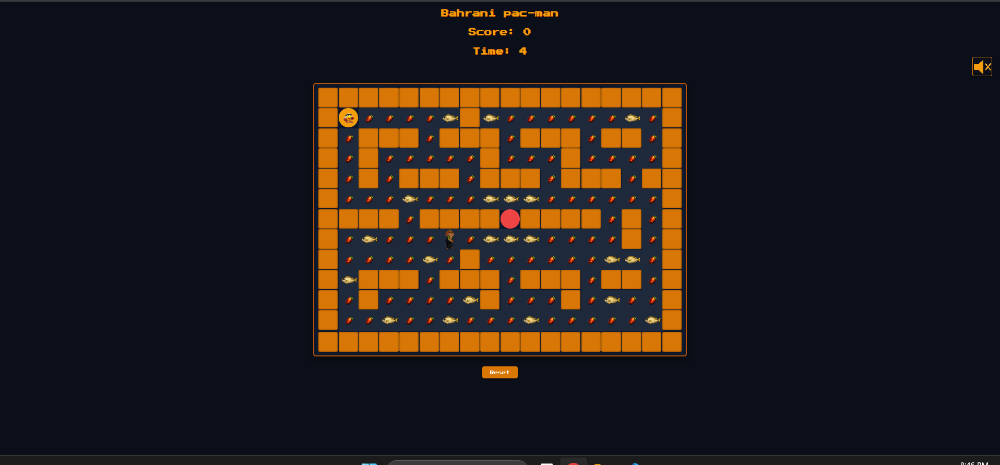

# Bahraini Pac-Man

## Technologies Used
1. HTML
2. CSS
3. JavaScript (JS)
## Description
a funa and innovative bahrain inspired version of the classic Pac-Man game built using HTML,CSS, and JS with DOM. Navigate through the maze as a Bahraini-themed characte, collect traditional items, avoid enemies and complete the level to win
## User Stories
 1. As a User, i wnat to move my character using the arrow keys so that I can explore the maze
 2. As a User, I want to collect all available items so that I can increase my score and complete the level
 3. As a User, I want walls to block my movement so that the maze is challenging
 4. As a User, I want my score to increase whenever I collect an item
 5. As a User, I want to win after collecting all items in the maze
 6. As a User, I want the game to end when an enemy catches me.

## Screenshots

## Future Enhancements
* add function that allow user to add custome player pic 
* Increase the size of maze
* Adding time based win condition
* increase the number of ghosts

## Credits
* W3School: https://www.w3schools.com/js/js_timers.asp
* Chatgpt 5: https://chatgpt.com/share/6a7cb28a-69b0-83eb-9103-fbcca5628338 For generatimg images